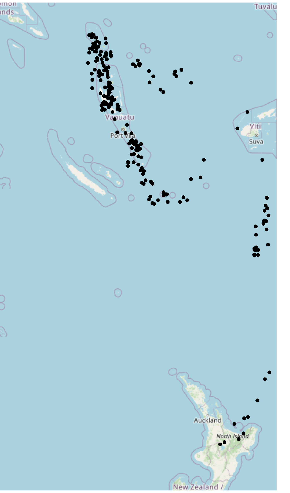
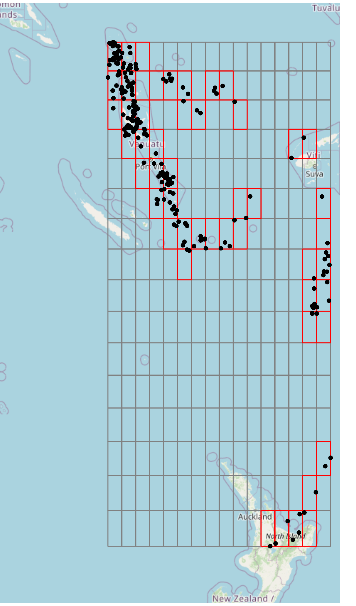

```{r, include = FALSE}
knitr::opts_chunk$set(
  collapse = TRUE,
  comment = "#>"
)
```

```{r setup}
library(hilbert)
```

The core utilities provided by `hilbert` involve converting coordinates to grid positions,
then grid positions to indices on a Hilbert Curve. This conversion is done *without* respect
to coordinate reference systems (CRS), **but**, the CRS of the original coordinates coincides
with the decoded coordinates.

## Example Dataset

Let's traverse through a simple example of using `hilbert`. We'll use a dataset of 1000 seismic events (with some filtered off)
that occurred near Fiji since 1964 (see: [`quakes`](https://stat.ethz.ch/R-manual/R-devel/library/datasets/html/quakes.html))

```{r}
data("quakes")
quakes <- quakes[quakes$long < 179.5, ]
```

```{r, echo = FALSE}
knitr::kable(
  head(quakes),
  format = "html",
  align = "c",
  table.attr = "style='width:100%;'",
  caption = "*Sample of Seismic Events (w/ MB > 4.0) Near Fiji Since 1964*"
)
```

## Encoding Process

### Extent

When working with coordinate data, we first need to consider the bounds of our grid.
Some methods utilize the maximum possible grid (i.e. [Geohash](https://en.wikipedia.org/wiki/Geohash)).

In this case, we will look at a localized approach, using the **extent** of our dataset as the grid bounds.

:::{style="display:flex;align-items:center;"}

::::::{style="margin-right:1rem;"}

```{r, echo = FALSE, out.width="100%", out.extra='style="border:none;pointer-events:none;user-select:none;"'}

```

::::::

::::::{}
When exploring this dataset, we see that it is particularly suitable for indexing
on a space-filling curve, due to the *closeness* of points. To index these points,
we'll perform the following operations:

1. Get the **extent** of the dataset.
2. Find the **position** of each point.
3. Convert the position to the curve **index**.

Getting the **extent** of this dataset is easy, it is simply the
min/max of both the X and Y coordinates.

```{r}
extent <- c(xmin = min(quakes$long), ymin = min(quakes$lat),
            xmax = max(quakes$long), ymax = max(quakes$lat))
```

```{r, echo = FALSE}
knitr::kable(
  t(extent),
  format = "html",
  col.names = c("X-Min", "Y-Min", "X-Max", "Y-Max"),
  align = "c",
  table.attr = "style='width:100%;'",
  caption = "*Quakes Extent*"
)
```
::::::

:::

> **Note:** *closeness* is often subjective. Generally, the real factor for determining how
> suitable coordinates are for indexing to a space-filling curve is the precision requirements.
> In this case, the precision of seismic events need not be highly-precise. However, in the case
> of coordinates for buildings, then high-precision is usually a requirement.

### Position

Now that we have the extent of these coordinates, let's get the **position**.

```{r}
positions <- hilbert::coords_to_position(
    x      = quakes,           # Using the `data.frame` method
    coords = c("long", "lat"), # Either the column names or indices for the coordinates
    n      = 4L,               # Dimensions exponent, i.e. 2^n x 2^n grid
    extent = extent,           # The previously found extent
    attach = FALSE             # When `TRUE`, attaches to the original `data.frame`
)
```

```{r, echo = FALSE}
tmp <- t(head(positions, 21))
tmp[, 21] <- c("...", "...")
rownames(tmp) <- c("**X-Position**", "**Y-Position**")
knitr::kable(tmp, col.names = NULL, row.names = TRUE)
```

Notice here, we choose $n = 4$. In the context of our grid, $n$ is the **dimensions exponent**.
It determines the dimensions of our underlying grid, such that when $n = 4$, we have a
$$2^n \times 2^n = 2^4 \times 2^4 = 16 \times 16 \text{ grid.}$$
A $2^n \times 2^n$ grid is required due to the construction of a Hilbert Curve,
see: [Space-filling Curves](https://wikipedia.org/wiki/Space-filling_curve).

:::{style="display:flex;align-items:center;"}
::::::{}
Now that we have our positions, we can visually see the cells that each point falls into.
Since the grid in this case is *coarse*, many points will be indexed to the same cell,
for example, the upper left-most cell.

This can be either unwanted or beneficial. If you're using a space-filling curve for
a **spatial index**, this could be beneficial, since points that are closer together
will be indexed together, and hence, spatial operations can be improved to only work on
points that fall under the same index. For more information,
see: [Spatial Index](https://en.wikipedia.org/wiki/Spatial_database#Spatial_index).

If we want to make our grid *finer*, we can increase the $n$ value used. For example,
setting $n = 6$ will give us a $64 \times 64$ grid, which will segement the points further.
::::::
::::::{style="margin-left:1rem;"}
```{r, echo = FALSE, out.width="100%", out.extra='style="border:none;pointer-events:none;user-select:none;"'}

```
::::::
:::

### Index

At this point, we can now index our positions. To do this, we simply take our `positions`
data frame, and call `hilbert::index`.

The same $n$ **must** be used in both `hilbert::coords_to_position`
and `hilbert::index`, otherwise, the indexing calculations will be incorrect.

```{r}
indices <- hilbert::index(positions, coords = c(1, 2), n = 4L)
```

```{r, echo = FALSE}
tmp <- t(head(indices, 21))
tmp[, 21] <- c("...", "...", "...")
rownames(tmp) <- c("**X-Position**", "**Y-Position**", "**Index**")
knitr::kable(tmp, col.names = NULL, row.names = TRUE)
```

:::{style="display:flex;align-items:center;"}
::::::{style="width:66%;margin-right:1rem;"}
```{r, echo = FALSE, out.width="100%", out.extra='style="border:none;pointer-events:none;user-select:none;"'}
knitr::include_graphics("3.png")
```
::::::
::::::{}
This index corresponds to the cell along the (purple) curve starting from the lower left cell, to the lower right cell.

We see here that space-filling curves provide a ${X, Y} \rightarrow I$ mapping.

Another attribute of these indices, is that they are always non-negative, whole numbers.
::::::
:::

## Summary

In general, users of `hilbert` will be concerned with indexing coordinates,
but we will lay out the general processes here:


#### Encoding
```r
COORDINATES
⟶ hilbert::coords_to_position()
  ⟶ POSITIONS
    ⟶ hilbert::index()
      ⟶ INDICES
```

#### Decoding
```r
INDICES
⟶ hilbert::position()
  ⟶ POSITIONS
    ⟶ hilbert::position_to_coords()
      ⟶ COORDINATES
```